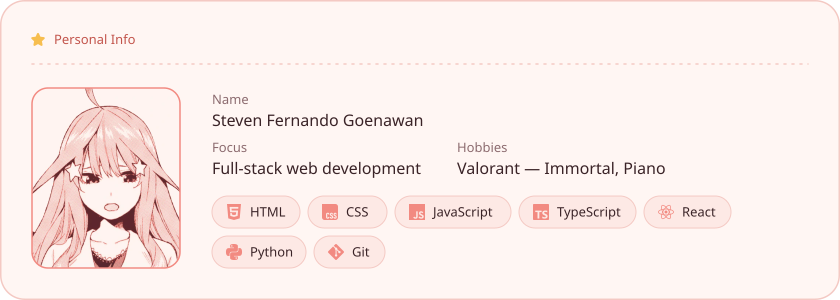
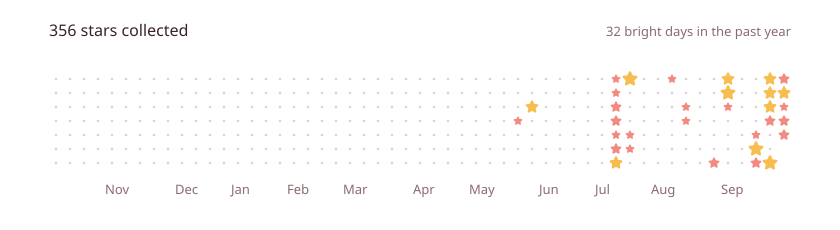

<picture>
  <source media="(prefers-color-scheme: dark)" srcset="assets/banner-dark.svg">
  
</picture>

<a href="https://github.com/Kqwaiyi/Companix">
  <picture>
    <source media="(prefers-color-scheme: dark)" srcset="assets/card-dark.svg">
    
  </picture>
</a>

<picture>
  <source media="(prefers-color-scheme: dark)" srcset="assets/stars-dark.svg">
  
</picture>

<picture>
  <source media="(prefers-color-scheme: dark)" srcset="assets/footer-dark.svg">
  
</picture>
